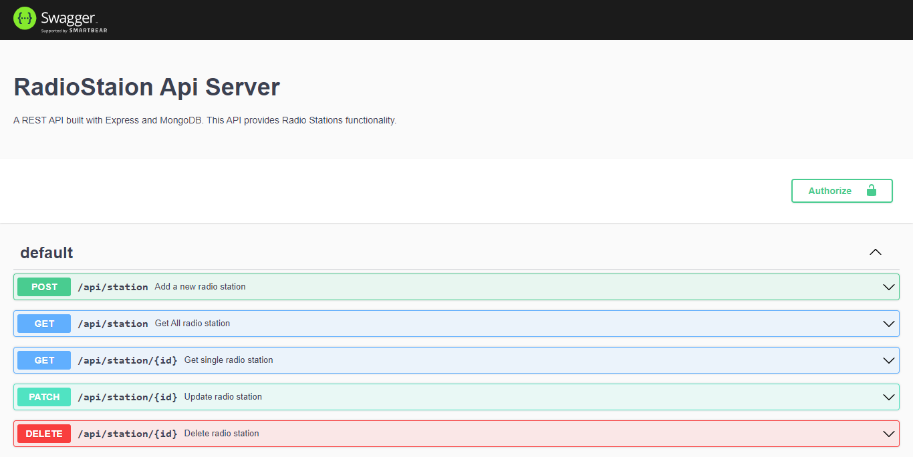
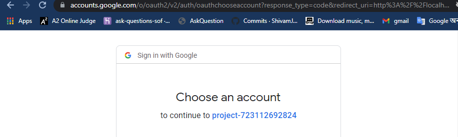
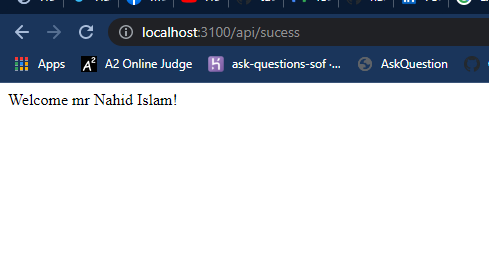
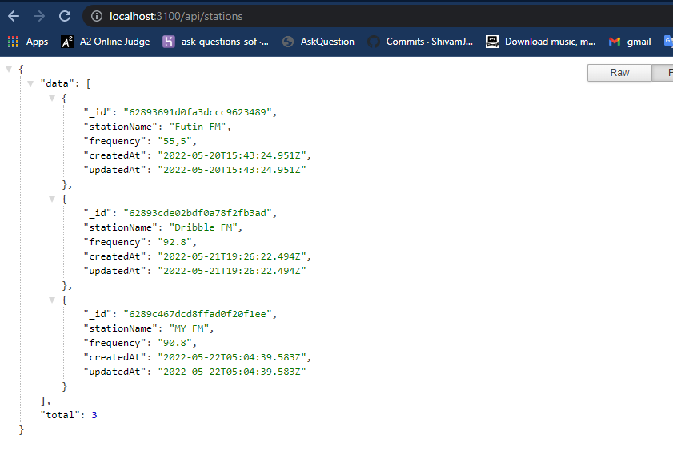

## This is simple radio widget Api Server.

---

## Project Status

Project is: _completed_

---

### Used Technology
- Express
- Mongoose
- passport oAuth2
- swaggerUI
- passport-google-oauth20

---

### Important URL
oAuth URL for authorization [`http://localhost:3100/api/google`](http://localhost:3100/api/google).

successfull redirect [`http://localhost:3100/api/sucess`](http://localhost:3100/api/sucess)

get all stations [`http://localhost:3100/api/stations/`](http://localhost:3100/api/stations)

get single stations [`http://localhost:3100/api/stations/:id`](http://localhost:3100/api/stations/:id)

create stations [`http://localhost:3100/api/stations/`](http://localhost:3100/api/stations/)

update stations [`http://localhost:3100/api/stations/:id`](http://localhost:3100/api/stations/:id)

delete stations [`http://localhost:3100/api/stations/:id`](http://localhost:3100/api/stations/:id)

swaggerUI url [`http://localhost:3100/api/`](http://localhost:3100/api/)

---
### important env inforamtion

```
APP_NAME=
APP_URL=
PORT=
MONGO_CONNECTION_STRING=
COOKIE_NAME=
COOKIE_SECRET=
CLIENT_ID=g
CLIENT_SECRET=
CALLBACK_URL=
```

---
### Demo Image






## Contact

Created by [Mazharul Islam](https://linkedin.com/in/nahid-islam-1aaa6814b) (Frontend Developer) - feel free to contact me!
